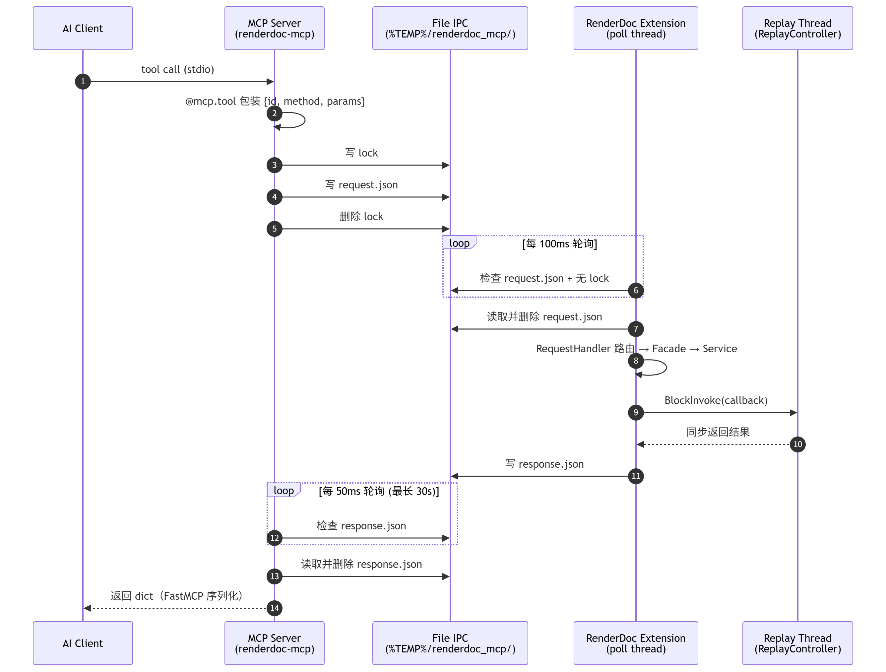
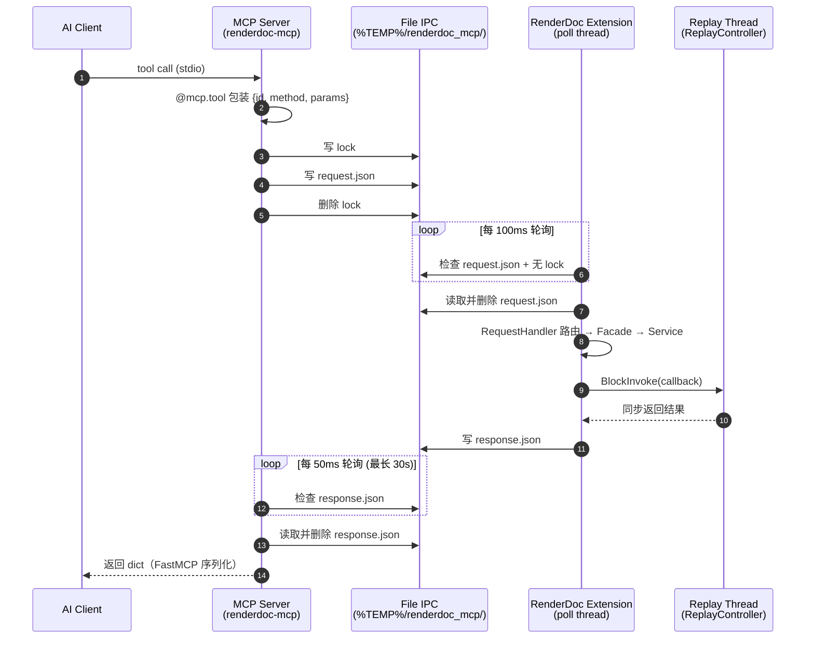

# RenderDoc MCP 服务器

作为 RenderDoc UI 扩展运行的 MCP 服务器。AI 助手可以访问 RenderDoc 的捕获数据，并辅助图形调试。

## 架构

```
Claude/AI Client (stdio)
        │
        ▼
MCP Server Process (Python + FastMCP 2.0)
        │ 基于文件的 IPC (%TEMP%/renderdoc_mcp/)
        ▼
RenderDoc Process (Extension)
```

由于 RenderDoc 内置的 Python 没有 socket 模块，因此使用基于文件的 IPC 进行通信。

## 一次调用的完整链路

以 AI 客户端调用 `get_pipeline_state(event_id=123)` 为例，整个请求会跨越 **3 个进程** 和一个 **文件 IPC 目录**（`%TEMP%/renderdoc_mcp/`）。

### 涉及的三个进程

| 进程 | 角色 | 入口 |
|------|------|------|
| AI 客户端 | 发起工具调用（Claude Desktop / Claude Code 等） | `claude_desktop_config.json` / `.mcp.json` |
| MCP Server | 桥接 LLM 协议与 RenderDoc | `mcp_server/server.py` → FastMCP 2.0 |
| RenderDoc 扩展 | 在 RenderDoc 内部运行，访问 ReplayController | `renderdoc_extension/__init__.py` |

### 文件 IPC 目录约定

`%TEMP%/renderdoc_mcp/` 下使用 3 个文件做同步：

| 文件 | 含义 |
|------|------|
| `request.json` | MCP Server → RenderDoc 的请求 |
| `response.json` | RenderDoc → MCP Server 的响应 |
| `lock` | 写入中标记。存在时表示正在写 `request.json`，对方不应读取 |

### 调用流程（9 步）

1. **客户端发起**：AI 客户端通过 stdio 把工具调用消息发给 `renderdoc-mcp` 进程。
2. **FastMCP 分发**：`server.py` 的 `@mcp.tool` 函数把参数打包成 `{id, method, params}`，交给 `bridge.call(...)`。
3. **写请求**（`bridge/client.py`）：
   - 创建 `lock` 文件 → 写入 `request.json` → 删除 `lock`（表示写入完成）
   - 随后每 50ms 轮询 `response.json`，超时 30s。
4. **读请求**（`renderdoc_extension/socket_server.py`）：后台守护线程每 100ms 轮询。发现 `request.json` 存在且 `lock` 不存在时，读取并删除请求文件。
5. **路由分发**（`request_handler.py`）：通过方法名表查到对应 `_handle_xxx`，调用 `RenderDocFacade` 的同名方法。
6. **Service 分层**（`renderdoc_facade.py`）：Facade 不做具体工作，分派给 6 个职责单一的 Service：`CaptureManager` / `ActionService` / `SearchService` / `ResourceService` / `PipelineService` / `MeshService`。
7. **进入 Replay 线程**：所有需要访问 `ReplayController` 的代码都经 `ctx.Replay().BlockInvoke(callback)` 排到 RenderDoc 的 replay 线程执行，避免线程安全问题。
8. **写响应**：Handler 把返回值打包成 `{id, result}`（或异常时 `{id, error}`），写到 `response.json`。
9. **客户端读响应**：MCP Server 端读取 `response.json` → 删除 → 返回 Python dict → FastMCP 序列化为 MCP 协议消息回传给 AI 客户端。

### 时序图

<!--  -->



### 关键设计点

- **没有 socket，用文件 IPC**：RenderDoc 内嵌 Python 3.6 缺少 `socket` / `QtNetwork`，所以用 lock 文件 + JSON 文件做信号同步。`lock` 存在 = 写入中，避免读到半截 JSON。
- **服务分层**：Facade 只做分发，具体逻辑分散在 `services/` 下 7 个 Service，底层共享 `utils/`（解析、序列化、helper），便于扩展新工具。
- **BlockInvoke 线程模型**：访问 `ReplayController` 必须经 `BlockInvoke` 排到 replay 线程，否则 RenderDoc 会崩溃，这是 Facade 强制约束。
- **菜单注册**：扩展加载时还会在 RenderDoc 的 `Tools` 菜单注册 "MCP Bridge → Status" 项，方便确认桥接是否在运行。

## 设置

> **快捷方式**：项目根目录提供 3 个 `.bat` 脚本（Windows），按顺序双击即可完成全部安装与启动：
> - `1.安装RenderDoc扩展.bat` — 把扩展拷贝到 RenderDoc 配置目录
> - `2.安装MCP服务器.bat` — 用 `uv` 安装 `renderdoc-mcp` 命令
> - `3.启动MCP Server.bat` — 手动启动一个 MCP Server 进程（用于调试，正常由客户端拉起）
>
> 下面是对应的命令行步骤，若 bat 脚本不满足需求可参考。

### 1. 安装 RenderDoc 扩展

```bash
python scripts/install_extension.py
```

默认安装到 `%APPDATA%\qrenderdoc\extensions\renderdoc_mcp_bridge`（Linux/macOS: `~/.local/share/qrenderdoc/extensions/`）。
安装器会同步写入 RenderDoc 的 `UI.config`，把 `renderdoc_mcp_bridge` 加入 `AlwaysLoad_Extensions`；下次启动 RenderDoc 时会自动加载。若只想复制文件、不改 RenderDoc 配置，可追加 `--no-always-load`。

#### 自定义 / 自编译 RenderDoc（多目标支持）

如果你使用自编译版本（例如可执行文件改名为 `qrenderzzs.exe`，配置目录就会变成 `%APPDATA%\qrenderzzs\`），可以通过以下几种方式指定安装位置，**优先级从高到低**：

1. **命令行参数**（一次性使用，支持多次指定）：
   ```bash
   python scripts/install_extension.py --extension-dir "%APPDATA%\qrenderzzs\extensions"
   python scripts/install_extension.py --extension-dir A --extension-dir B   # 一次装多处
   ```

2. **配置文件 `.renderdocmcp.json`**（项目根目录，已被 `.gitignore` 忽略，适合个人配置）：
   ```json
   {
     "targets": {
       "official":   { "extension_dir": "%APPDATA%/qrenderdoc/extensions" },
       "qrenderzzs": { "extension_dir": "%APPDATA%/qrenderzzs/extensions" }
     },
     "default_targets": ["official", "qrenderzzs"]
   }
   ```
   参考 `.renderdocmcp.json.example`。配置好后直接 `python scripts/install_extension.py` 会同时装到所有 `default_targets`；也可以 `--target qrenderzzs` 只装一个，或 `--target all` 装全部。

3. **环境变量** `RENDERDOC_EXTENSION_DIR`（CI 或临时切换场景）：
   ```bash
   set RENDERDOC_EXTENSION_DIR=%APPDATA%\qrenderzzs\extensions
   python scripts/install_extension.py
   ```
   支持用 `;`（Windows）或 `:`（Unix）分隔多个路径。

卸载同样支持上述参数：`python scripts/install_extension.py uninstall [--target ...]`。

### 2. 重启 RenderDoc

安装脚本已经启用了 Always Load。关闭并重新启动 RenderDoc 后，`renderdoc_mcp_bridge` 会自动加载。

### 3. 安装 MCP 服务器

```bash
uv tool install
uv tool update-shell  # 添加到 PATH
```

重启 shell 后即可使用 `renderdoc-mcp` 命令。

> **Note**: 添加 `--editable` 后，源代码的修改会立即生效（便于开发）。
> 如果要安装稳定版本，请使用 `uv tool install .`。

### 4. 配置 MCP 客户端

#### Claude Desktop

添加到 `claude_desktop_config.json`:

```json
{
  "mcpServers": {
    "renderdoc": {
      "command": "renderdoc-mcp"
    }
  }
}
```

#### Claude Code

添加到 `.mcp.json`:

```json
{
  "mcpServers": {
    "renderdoc": {
      "command": "renderdoc-mcp"
    }
  }
}
```

## 使用方法

1. 启动 RenderDoc，并打开捕获文件 (.rdc)，或用 `capture_frame` / `launch_application` 启动程序并抓帧
2. 从 MCP 客户端（如 Claude）访问 RenderDoc 数据

## MCP 工具列表

### 连接与状态

| 工具 | 说明 |
|--------|------|
| `ping` | 检查 RenderDoc MCP Bridge 是否可达 |
| `get_capture_status` | 检查捕获文件的加载状态 |
| `get_frame_summary` | 获取当前帧的统计信息（API、Draw 数、Marker 列表等） |

### 帧结构、Draw 与 Pass 分析

| 工具 | 说明 |
|--------|------|
| `get_draw_calls` | 以层级结构获取绘制调用列表，支持 marker、event_id、flags 等过滤 |
| `get_draw_call_details` | 获取指定绘制调用的详细信息 |
| `list_passes` | 列出 marker 或按 RT 变化推断出的 Render Pass 区间 |
| `get_pass_info` | 获取某个 event 所在 Pass 的 draw/dispatch 列表与统计 |
| `get_pass_attachments` | 获取某个 Pass 的 color/depth attachments |
| `get_pass_statistics` | 获取每个 Pass 的 draw/dispatch/triangle/RT 尺寸统计 |
| `get_pass_deps` | 构建 Pass 之间的资源读写依赖图 |
| `find_unused_targets` | 查找写入后未贡献到最终输出的渲染目标/资源 |

### GPU 计时、Counter 与 Shader 调试

| 工具 | 说明 |
|--------|------|
| `get_action_timings` | 获取 GPU 计时（按 event_id / marker 过滤） |
| `enumerate_counters` | 列出当前捕获可用的 GPU performance counters |
| `fetch_counters` | 按 counter ID 获取 GPU counter 数值 |
| `get_debug_messages` | 获取 API validation / driver debug messages |
| `debug_pixel` | 调试指定 event 下某个屏幕像素的 Pixel Shader 执行过程 |
| `debug_vertex` | 调试指定 event 下某个顶点的 Vertex Shader 执行过程 |

### Shader、常量缓冲与管线状态

| 工具 | 说明 |
|--------|------|
| `find_draws_by_shader` | 按 Shader 名查找使用该 Shader 的 Draw |
| `get_shader_info` | 获取着色器源代码和常量缓冲区的值 |
| `get_bound_textures` | 获取指定 event/stage 绑定的纹理，并推断 albedo/normal/roughness 等用途 |
| `list_cbuffers` | 列出指定 shader stage 绑定的常量缓冲区 |
| `get_cbuffer_contents` | 读取指定常量缓冲区的变量名、类型和值 |
| `list_shaders` | 扫描整帧 draw/dispatch，列出唯一 Shader 及使用次数 |
| `search_shaders` | 在全局 Shader 反汇编文本中搜索关键字 |
| `get_pipeline_state` | 获取管线状态（含 IA 布局、VB/IB 绑定） |

### 资源、纹理与 Buffer

| 工具 | 说明 |
|--------|------|
| `find_draws_by_texture` | 按贴图名查找使用该贴图的 Draw |
| `find_draws_by_resource` | 按 Resource ID 精确查找使用该资源的 Draw |
| `get_buffer_contents` | 获取缓冲区内容 (Base64)，可选 `event_id` 读取瞬态缓冲 |
| `get_textures` | 列出当前捕获中的所有纹理资源 |
| `get_buffers` | 列出当前捕获中的所有 buffer 资源 |
| `get_resources` | 列出当前捕获中的所有 RenderDoc resources |
| `get_resource_info` | 获取任意 Resource 的详细元数据（texture/buffer/resource） |
| `get_resource_usage` | 获取 Resource 在整帧中的使用历史与读写分类 |
| `get_texture_info` | 获取纹理元数据 |
| `get_texture_data` | 获取纹理像素数据 (Base64)，**仅限小贴图**（base64 经上下文，大贴图会溢出） |
| `pick_pixel` | 读取指定纹理/RT 的单个像素 RGBA 值 |
| `pixel_history` | 获取指定 RT 像素在整帧中的修改历史 |
| `export_texture_to_file` | **将纹理写入图片文件（宿主侧 SaveTexture），大贴图首选**，自动处理 typeless/解压/朝向 |

### Mesh 与 Transform 导出

| 工具 | 说明 |
|--------|------|
| `get_mesh_data` | 提取 Draw 的解码后顶点/索引数据（含属性按 format 解析，返回对象空间数据） |
| `get_world_matrix` | 从 VS cb0 读取 Unity `unity_ObjectToWorld` / `unity_WorldToObject` 矩阵 |
| `export_mesh_to_file` | 将 Draw 的顶点/索引数据写入 JSON 文件，可烘焙到世界空间，适合大模型导出 |

### 捕获文件与目标程序控制

| 工具 | 说明 |
|--------|------|
| `list_captures` | 列出目录中的 .rdc 文件 |
| `open_capture` | 在 RenderDoc 中打开指定捕获文件 |
| `capture_frame` | 通过 RenderDoc 启动目标程序，等待若干帧后抓取一帧并自动打开 |
| `launch_application` | 通过 RenderDoc 启动目标程序并保留 target control 会话 |
| `get_target_status` | 查询 `launch_application` 启动的目标程序是否仍可控 |
| `trigger_capture` | 对已启动目标程序触发一次截帧并保存 .rdc |
| `close_target` | 关闭 target control 会话并释放 RenderDoc/MCP 内部状态 |
| `launch_renderdoc` | 启动 qrenderdoc 并打开 .rdc，等待 MCP Bridge ready |

## 使用示例

### 获取绘制调用列表

```
get_draw_calls(include_children=true)

# 只看指定 marker 下的 draw/dispatch，并限制 event_id 范围
get_draw_calls(marker_filter="Character", event_id_min=100, event_id_max=300, only_actions=true, flags_filter=["Drawcall", "Dispatch"])
```

### 获取着色器信息

```
get_shader_info(event_id=123, stage="pixel")
```

### 常量缓冲区读取

```
# stage 支持 vs/hs/ds/gs/ps/cs，也支持 vertex/pixel/compute 等全名
list_cbuffers(stage="ps", event_id=123)

# index 来自 list_cbuffers 返回值
get_cbuffer_contents(stage="ps", index=0, event_id=123)
```

### Shader 全局索引与搜索

```
# 扫描整帧 draw/dispatch，列出唯一 shader 与首次出现 event
list_shaders(max_events=10000, max_shaders=200)

# 在反汇编中搜索关键字；D3D 可优先尝试 disassembly_target="HLSL"
search_shaders(pattern="_BaseColor", stage="ps", limit=20, disassembly_target="HLSL")
```

### Pass / Frame 结构分析

```
# 列出 marker-based pass；无 marker 时按 render target 变化推断 synthetic pass
list_passes()

# 查询某个 event 所在 pass 的 draw/dispatch 列表
get_pass_info(event_id=123)

# 查询 pass 附件、统计和资源依赖
get_pass_attachments(event_id=123)
get_pass_statistics()
get_pass_deps()

# 查找写入后未进入最终输出链路的目标资源
find_unused_targets()
```

### 获取管线状态

```
get_pipeline_state(event_id=123)
```

### 获取纹理数据

```
# 获取 2D 纹理的 mip 0
get_texture_data(resource_id="ResourceId::123")

# 获取指定 mip 级别
get_texture_data(resource_id="ResourceId::123", mip=2)

# 获取立方体贴图的指定面 (0=X+, 1=X-, 2=Y+, 3=Y-, 4=Z+, 5=Z-)
get_texture_data(resource_id="ResourceId::456", slice=3)

# 获取 3D 纹理的指定深度切片
get_texture_data(resource_id="ResourceId::789", depth_slice=5)
```

### 导出纹理到图片文件（大贴图首选）

```
# 宿主侧直接落盘 PNG，base64 不经过对话上下文，任意大小都稳定
export_texture_to_file(
    resource_id="11059",
    output_path="E:\\proj\\Textures\\T_Albedo.png",
    file_type="PNG")          # PNG/JPG/BMP/TGA/HDR/EXR/DDS

# 阴影/深度等 typeless 格式会自动 typecast 为 UNorm 导出
export_texture_to_file(resource_id="14452",
    output_path="E:\\proj\\Textures\\T_Shadow.png")

# 瞬态渲染目标需先定位到产生它的 event
export_texture_to_file(resource_id="...", output_path="...\\rt.png", event_id=313)
```

> ⚠️ 为什么不用 `get_texture_data` 导大图：它返回的 base64 **会流经对话上下文**，
> 1024² RGBA8 ≈ 1.4M token，单张即溢出上下文窗口。`export_texture_to_file`
> 调用 RenderDoc 原生 `SaveTexture`，在宿主侧解码+编码后写盘，只回传元信息。

### 部分获取缓冲区数据

```
# 获取整个缓冲区
get_buffer_contents(resource_id="ResourceId::123")

# 从偏移 256 处获取 512 字节
get_buffer_contents(resource_id="ResourceId::123", offset=256, length=512)

# 读取某个 Draw 上的瞬态缓冲（例如常量缓冲上传）
get_buffer_contents(resource_id="ResourceId::123", event_id=456)
```

### 资源详情与使用历史

```
# 获取 texture/buffer/resource 的详细元数据
get_resource_info(resource_id="ResourceId::123")

# 获取整帧 ResourceUsage 历史，含 event 名称和 read/write 分类
get_resource_usage(resource_id="ResourceId::123")
```

### 实时启动程序并抓帧

```
capture_frame(
    exe_path="D:\\Game\\Game.exe",
    working_dir="D:\\Game",
    cmd_line="-windowed",
    delay_frames=100,
    output_path="D:\\captures\\game_auto.rdc",
    timeout_seconds=60)
```

> `capture_frame` / `launch_application` 需要 qrenderdoc 中已经加载 MCP Bridge，并依赖当前 RenderDoc Python 绑定暴露
> `ExecuteAndInject` / `CreateTargetControl` 或对应 `RENDERDOC_*` 接口。

### 启动模拟器并按需截帧

```
launch = launch_application(
    exe_path="D:\\MuMuPlayer-12.0\\shell\\MuMuPlayer.exe",
    working_dir="D:\\MuMuPlayer-12.0\\shell",
    cmd_line="",
    graphics_api="vulkan")

# 返回 {"session_id": "...", "pid": 12345, ...}
get_target_status(session_id=launch["session_id"])

trigger_capture(
    session_id=launch["session_id"],
    output_path="D:\\captures\\mumu12_frame.rdc",
    timeout_seconds=60)

close_target(session_id=launch["session_id"])
```

> `graphics_api` 支持 `auto`、`vulkan`、`d3d11`、`d3d12`、`opengl`、`gles`。
> 它用于 RenderDoc 启动环境设置；目标程序最终创建哪个图形 API 仍由目标程序自身决定。

### 提取 Draw 的几何数据

```
# 一次性拿到 IB + 解码后的所有顶点属性；适合小网格或调试抽样
get_mesh_data(event_id=123)
```

### 读取 Unity 世界矩阵

```
# 从 VS cb0 读取 unity_ObjectToWorld / unity_WorldToObject
get_world_matrix(event_id=123)

# 如果 shader 中矩阵偏移不同，可根据 get_pipeline_state 中的 $Globals 变量偏移调整
get_world_matrix(event_id=123, o2w_offset=32, w2o_offset=96)
```

### 导出网格到文件

```
# 将大网格直接写到 RenderDoc 所在机器的 JSON 文件，避免 MCP 返回体过大
export_mesh_to_file(event_id=123, output_path="D:\\Temp\\mesh_123.json")

# 默认会烘焙到世界空间；如需保持对象空间，可关闭 bake_world
export_mesh_to_file(event_id=123, output_path="D:\\Temp\\mesh_123_object.json", bake_world=false)

# 如果顶点属性所在 slot 与默认 Unity 布局不同，可显式指定
export_mesh_to_file(event_id=123, output_path="D:\\Temp\\mesh_123.json", pos_slot=0, normal_slot=1, tangent_slot=2, uv0_slot=3)
```

## 要求

- Python 3.10+
- [uv](https://docs.astral.sh/uv/)
- RenderDoc 1.20+

> **Note**: 目前仅在 Windows + DirectX 11 环境中进行过运行确认。
> 在 Linux/macOS + Vulkan/OpenGL 环境中也可能运行，但尚未验证。

## 许可证

MIT
